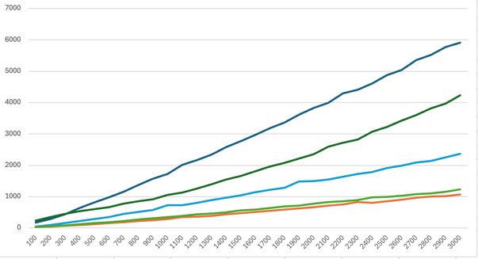

# SET-9 A1

## Тазеев Алмаз Дамирович БПИ-235

### [StringGenerator](StringGenerator.cpp)

### [StringSortTester](StringSortTester.cpp)

## Результаты эмпирических замеров:
[Резы](/outputs/) - среднее время и кол-во сравнений для всех видов массивов

## Сортировки:
#### A1m - 321287133
#### A1q - 321291607
#### A1r - 321293378
#### A1rq - 321293950

## Сравнительный анализ:

### Обобщающий график:

### Particle Sorted:
Лучшие характеристики и по времени, и по количеству сравнений - алгоритм Hybrid MSD Radix Sort

### Back Sorted:
Лучшие характеристики по временным затратам дает алгоритм Hybrid MSD Radix Sort

Лучшие характеристики по количеству посимвольных сравнений показывает алгоритм LCP Merge Sort

### Random Sorted:
Лучшие характеристики и по времени, и по количеству сравнений - алгоритм Hybrid MSD Radix Sort

Худшие временные показатели имеет алгоритм LCP Merge Sort

## Сравнение с теоретической оценкой сложности:
По текущему сгенерированному набору выходит, что полученные результаты **соотвествуют** теоретической оценке сложности

## Вывод:
Лучшим алгоритмом для сортировки массива строк среди представленных является Hybrid MSD Radix Sort. Следует отметить что стандартные алгоритмы сортировки проявили себя хуже, чем адаптированные под строки